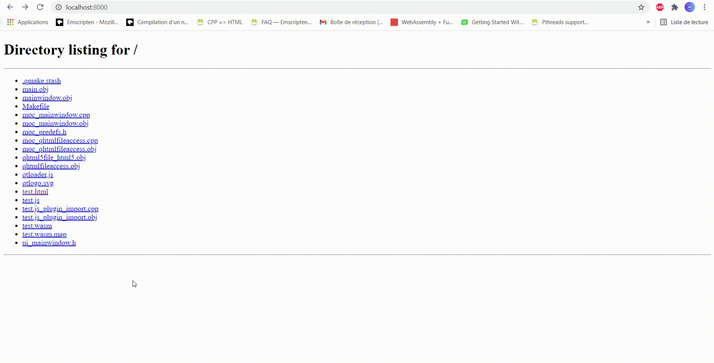

Wasm OpenFile (using Qt)
================== 

Installation and configuration:
 1. Install Emscripten SDK and activate minimal configuration (Python, Java and CLang) following *emsdk* documentation. Activate also MinGW when building sample on Windows host.
~~~~~
    > https://emscripten.org/docs/getting_started/downloads.html
~~~~~
 2. Install Qt.
~~~~~
    > https://www.qt.io/download
~~~~~
 3. Create new project with Qt WebAssembly, execute QMake and build it.
 4. Install Apache Lounge (for the local server):
~~~~~
    > https://www.apachelounge.com/download/
~~~~~
 5. Open "httpd.conf" (C:\Apache24\conf).
~~~~~
    Line 251 and 252, replace the base path with your build folder location  :
    > DocumentRoot "build_folder_location"
    > <Directory "build_folder_location">

    Line 416, remove the "#" and add ".wasm" : 
    > AddEncoding x-gzip .gz .tgz .wasm
~~~~~
 6. Compress the .wasm file :
~~~~~
    > https://gzip.swimburger.net/  
~~~~~
 7. Put the .gz file in the build_folder_location, delete the original .wasm, and rename the .gz file to .wasm :
~~~~~
    "wasm-openfile.wasm.gz" -> "wasm-openfile.wasm"
~~~~~
 8. Run "httpd.exe" (C:\Apache24\bin), open compatible browser and enter path taking into account your web server settings :
~~~~~
    > http://localhost/wasm-openfile.html
~~~~~

# Gallery

